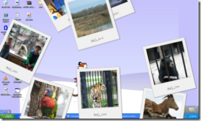

# c4f-photoscreensaver

MSDN - Coding 4 Fun - Photo Screensaver  \
_Imported from [CodePlex archive](https://archive.codeplex.com/?p=photoscreensaver)_

**Project Description**  
Yes, another screensaver\! This uses GDI+ and renders images in Polaroid-style. It can scan a directory, or find images using Windows Search. Can be run on multiple monitors, and even supports stand-alone mode for other purposes (DJ, party). Written in C\#.

## Introduction

Everyone loves screensavers\! Photo screensavers are fun because you can show off your own photos in creative ways. This project will step you through creating a Windows screensaver to show off your photo collection. Learn about GDI+ and what it takes to build a custom screensaver. Update: This would have been way easier in WPF\! At some point maybe I'll update it...  
  
  
  
In trying to bite off new things, I decided it would be fun to create a new screensaver. Visual Studio Express comes with an RSS screensaver starter kit, but I never looked at it too closely. It turns out that screensavers are pretty easy to make, though you'll need to do some work with graphics. If you're not afraid to think in terms of bitmaps and drawing operations, you can do some fun things\!  
  
This code has been tested up to Windows 7.  

## Usage

As a screensaver (.scr extension) it's pretty straight-forward. Copy it to your **Windows** folder and it will show up in your screensaver list. If you run it with the /c argument, you'll get the configuration window. This is how Windows shows screensaver settings. I should point out that this screensaver only works on one monitor.  
  
  
  
**Party Mode**  
If you use the .exe extension, it will run in stand-alone (party) mode. This means, that moving the mouse won't exit it. You'll need to press **Escape** to kill it. This is handy to show images on the screen during a party. Here's the cool thing: if you are monitoring a folder and images are moved into that folder while it's running, they'll be added to the mix. A DJ in England used this mode to allow guests to send cameraphone pictures via Bluetooth where they got copied to the folder and showed up on the screen soon after\! If you have more than one monitor, stand-alone mode lets you choose the monitor when it starts up. This lets you keep your music software (or other stuff) on one screen, and the images on another (perhaps projected).  
  
*Note: This code was originally published as part of an MSDN Coding 4 fun [article](https://web.archive.org/web/20131202110912/http://channel9.msdn.com/coding4fun/articles/Photo-Screensaver).*